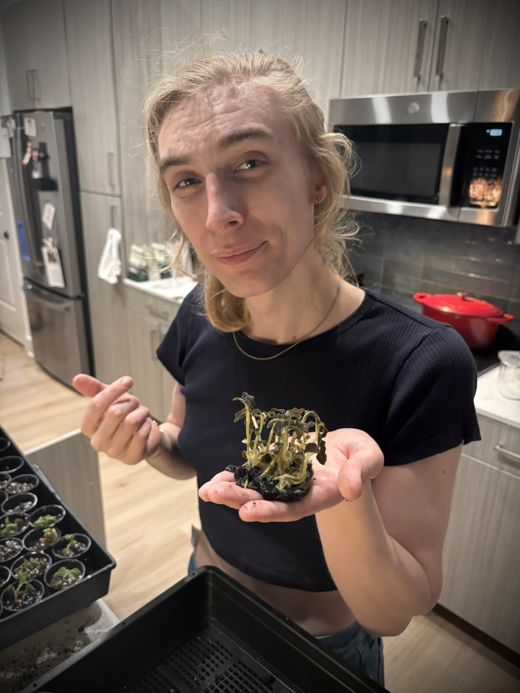

Welcome! I’m Emma, the owner of *Tiger Lily Plants*, a queer & woman-owned exotic plant and terrarium store. I grow rare orchids and begonias and I love sharing their charm beyond my own shelves.

I’m a lifelong builder at heart: by day I work as a software engineer, writing code and solving problems, and by night I’m a plant enthusiast and terrarium builder. This blend of tech, love and nature is what inspires everything I grow and create. 🌿

Thanks so much for visiting my store and be sure to check out my [Etsy](https://etsy.com/shop/TigerLilyPlants).

Happy growing!